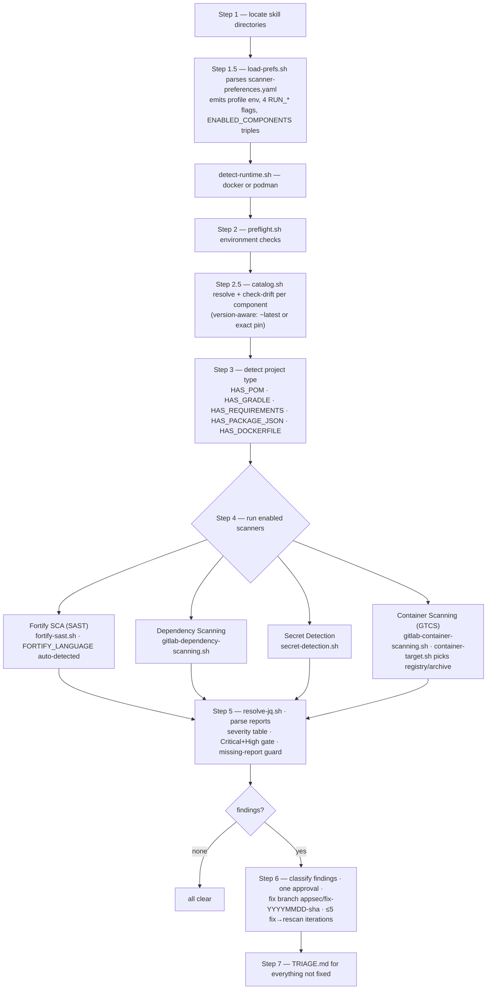
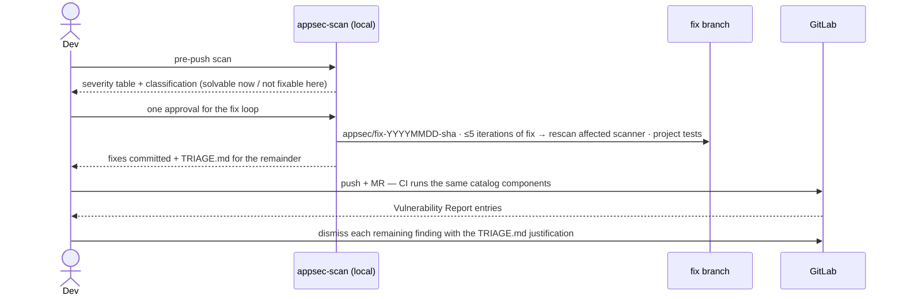
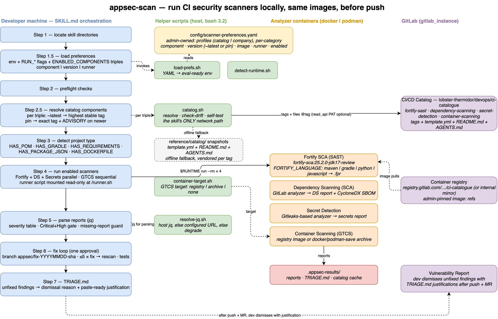

# appsec-scan — Architecture

`appsec-scan` runs the **same security scanners as CI, locally, using the same container
images**, before code is pushed to GitLab. Scanner selection, component versions, and
images come from one admin-owned config file — the model executing the skill only reads
config and invokes helper scripts; it never guesses endpoints or parses YAML. After a
scan it offers a fix loop on a dedicated branch, and everything it cannot fix lands in a
guided triage plan (`.appsec-results/TRIAGE.md`) mapped to the GitLab Vulnerability
Report dismissal workflow.

The scanners are the four components of the private GitLab CI/CD Catalog at
`gitlab.com/lobster-thermidor/devops/ci-catalogue`:

| Category | Catalog component | Shipped version | Runner | What runs locally |
|---|---|---|---|---|
| SAST | `…/fortify-sast/fortify-sast` | `~latest` (25.2.0) | `fortify-sast.sh` | `fortify-sca` image; multi-language: maven, gradle, python, javascript |
| Dependency Scanning (SCA) | `…/dependency-scanning/dependency-scanning` | `~latest` (1.0.0) | `gitlab-dependency-scanning.sh` | GitLab-native SCA analyzer, SBOM output |
| Secret Detection | `…/secret-detection/secret-detection` | `~latest` (1.0.0) | `secret-detection.sh` | GitLab-native Gitleaks-based analyzer |
| Container Scanning | `…/container-scanning/container-scanning` | `~latest` (1.0.0) | `gitlab-container-scanning.sh` | GTCS; registry image or locally built archive |

(`…` = `lobster-thermidor/devops/ci-catalogue`. Component paths are
`<project-path>/<template-name>`; every component repo ships `templates/<name>.yml`,
`README.md`, and an agent-oriented `AGENTS.md`.)

DAST is deliberately **not** part of this skill — it needs a deployed target and a GitLab
runner, which doesn't fit a shift-left local scan. Use the `appsec-dast-sim` skill for
design-time DAST simulation, or the catalogue's `dast` / `api-security` components in CI.

## How a scan runs

`SKILL.md` is an orchestration script the model executes step by step. Mechanical work
lives in `scripts/` (host side) and `scanners/` (container side); the model's job is
sequencing, result interpretation, and the fix loop.



Fortify, Dependency Scanning, and Secret Detection run **in parallel** (backgrounded,
PIDs collected by a wait loop); Container Scanning runs sequentially. Every scanner is a
`$RUNTIME run --rm` with its runner script mounted read-only at `/runner.sh` — scanner
logic ships with the skill, not baked into images.

## Component resolution (Step 2.5)

`load-prefs.sh` emits `ENABLED_COMPONENTS` as space-separated
**`component|version|runner`** triples. For each triple, `catalog.sh` resolves the
component against the active profile's `gitlab_instance` — live on every run — and
caches `template.yml`, `README.md`, and `AGENTS.md` per resolved tag. The catalog is
**advisory**: the image that actually runs is always the admin-pinned `image:` from
config; resolution exists to surface the component's usage docs and to warn when the
pinned world drifts from the catalog.

```mermaid
sequenceDiagram
    participant M as SKILL.md Step 2.5
    participant CS as catalog.sh
    participant GL as gitlab_instance API
    participant SN as reference/catalog/ snapshots
    M->>CS: resolve instance component version cache [token_env]
    alt version is ~latest
        CS->>GL: GET repository/tags
        GL-->>CS: tag list
        Note over CS: highest stable tag<br/>(prereleases and v-prefix excluded)
    else exact pin (e.g. 25.2.0)
        Note over CS: pinned tag used as-is
        CS->>GL: GET repository/tags (comparison only, non-fatal)
        CS-->>M: ADVISORY when a newer stable tag exists
    end
    CS->>GL: GET template.yml + README.md + AGENTS.md at tag
    GL-->>CS: files cached per component@tag
    CS-->>M: component@tag [online]
    opt network or auth failure
        CS->>SN: pinned tag dir if present, else highest snapshot
        CS-->>M: component@tag [offline-fallback]
    end
    M->>CS: check-drift component cache runner
    CS-->>M: DRIFT lines (runner &gt;90 days stale, image tag mismatch)
```

Auth is anonymous first; if the instance rejects reads, the skill asks for a `read_api`
PAT and the env var named in `settings.catalog.auth_token_env` (the token is passed via
`curl --config`, never argv).

## Configuration — `config/scanner-preferences.yaml`

Admin-owned (Platform Team via CODEOWNERS). One file declares everything the skill may
touch. Full schema and switching guide: [`config/PREFERENCES.md`](config/PREFERENCES.md).

| Setting | Meaning |
|---|---|
| `settings.airgap` | `true` = no public internet: profiles whose `gitlab_instance` is gitlab.com are refused; offline is not an error. Ships `false` (default profile targets gitlab.com) |
| `settings.container_runtime` | `auto` (docker, then podman) or forced |
| `settings.jq.*` | host jq preferred; optional install URL; degrades to UNKNOWN severity summary |
| `settings.catalog.mode` | `online` (resolve live) or `offline` (snapshots only) |
| `settings.catalog.auth_token_env` | env var holding a `read_api` PAT; empty = anonymous |
| `settings.container_registry.*` | env var *names* for registry credentials used by GTCS |

Two profiles (`APPSEC_PROFILE` overrides `default_profile`):

- **`catalog`** (default) — `https://gitlab.com`, the four lobster-thermidor components,
  images from the catalogue's registries.
- **`company`** — internal-mirror placeholder: same component names on the internal
  GitLab instance, images from the internal JFrog. This is the airgap-safe profile.

Each category block is five keys:

```yaml
sast:
  component: lobster-thermidor/devops/ci-catalogue/fortify-sast/fortify-sast
  version: "~latest"       # or an exact tag, e.g. "25.2.0"
  image: registry.gitlab.com/lobster-thermidor/devops/ci-catalogue/fortify-sast/fortify-sca:25.2.0-jdk17-review
  runner: fortify-sast.sh
  enabled: true
```

`version:` is the platform team's pinning lever, per component:

- **`~latest`** (shipped default) — resolve the highest stable tag on every run.
- **exact tag** — reproducible resolution; `catalog.sh` prints
  `ADVISORY: <component> pinned <X>, newer stable <Y> available` when the catalog moves,
  so pins never rot silently.

`image:` stays independently pinned — bump it when a DRIFT/ADVISORY line says the
component moved and you have mirrored the new image.

## Network and airgap policy

- `scripts/catalog.sh` is the **only** network path in the skill, and it only talks to
  the active profile's `gitlab_instance`. No WebFetch, no other hosts.
- Fully offline operation: `settings.catalog.mode: offline` (or any network failure)
  falls back to the vendored snapshots under
  `reference/catalog/lobster-thermidor/devops/ci-catalogue/<name>/<name>/<tag>/`.
- Scanner images are admin-pinned refs; in airgapped environments they point at the
  internal mirror (see the mirror table in the repo-root README).

## Findings, fix loop, and triage

Scan results are the start of the workflow, not the end. Findings the skill can fix are
fixed on a dedicated branch; everything else must end up **dismissed with a
justification in the GitLab Vulnerability Report** — `TRIAGE.md` is the bridge.



Each `TRIAGE.md` entry carries the finding location, why it was not fixed locally, one of
the five GitLab dismissal reasons, and a paste-ready justification comment. Guardrails:
one approval gates the loop, the loop aborts early on no-progress, history is never
rewritten, and nothing is pushed without an explicit ask.

## File map

```
appsec-scan/
├── SKILL.md               orchestration script the model executes (never edits)
├── README.md              this document
├── UPDATE-GUIDE.md        maintainer guide: sync scenarios, snapshot refresh
├── docs/
│   ├── architecture.drawio   editable poster source
│   └── architecture.png      exported poster (embedded below)
├── config/
│   ├── scanner-preferences.yaml   admin-owned truth: profiles, components, versions, images
│   └── PREFERENCES.md             schema + switching guide
├── scripts/               host-side helpers — bash 3.2 / POSIX awk safe
│   ├── load-prefs.sh      YAML → eval-ready env; the model never parses YAML
│   ├── catalog.sh         resolve / check-drift / self-test
│   ├── detect-runtime.sh  docker | podman
│   ├── resolve-jq.sh      jq from PATH or configured URL, else degrade
│   └── container-target.sh  what GTCS scans: registry | archive | none
├── scanners/              run INSIDE Linux analyzer containers (mounted at /runner.sh)
│   ├── preflight.sh
│   ├── fortify-sast.sh    multi-language SAST: maven | gradle | python | javascript
│   ├── gitlab-dependency-scanning.sh
│   ├── secret-detection.sh
│   └── gitlab-container-scanning.sh
├── reference/catalog/…    vendored component snapshots (template.yml + README.md + AGENTS.md)
└── tests/                 pytest suite — hermetic; docker smoke tests env-gated
```

## Architecture poster



The editable source is [`docs/architecture.drawio`](docs/architecture.drawio)
(diagrams.net). Re-export the PNG after editing:
`draw.io -x -f png -s 1.5 -o docs/architecture.png docs/architecture.drawio`.

## Platform team: bumping a component version

1. Edit the category's `version:` in `config/scanner-preferences.yaml` (exact tag or
   back to `~latest`).
2. If the component's default image moved (DRIFT/ADVISORY line), mirror the new image
   and bump the category's `image:`.
3. Refresh the vendored snapshot — UPDATE-GUIDE.md "Refresh catalog snapshots":
   `catalog.sh resolve <instance> <component> <version> <cache>` then copy
   `template.yml`, `README.md`, `AGENTS.md` into `reference/catalog/…/<tag>/`.
4. Update the runner's `# Last synced :` header if its logic was reviewed against the
   new template.
5. `python3 -m pytest plugins/appsec/skills/appsec-scan/tests/ -v`.
