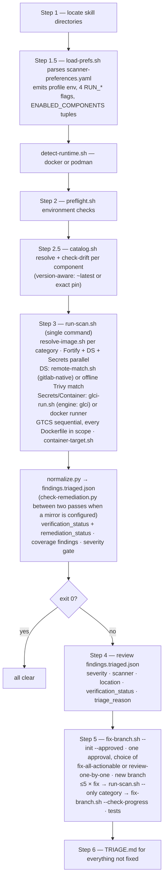
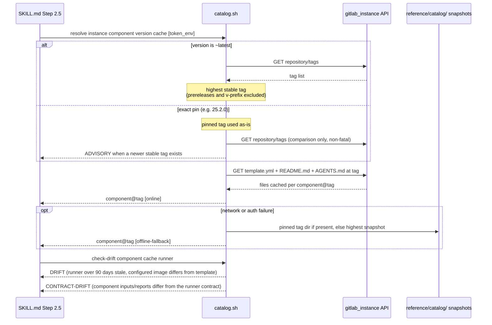
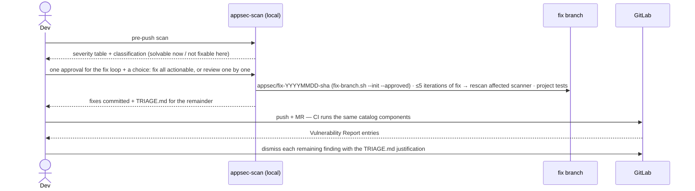

# appsec-scan — Architecture

> **Looking for how to run a scan?** See [`../README.md`](../README.md).
> This document explains how the skill works internally — for maintainers and reviewers.

`appsec-scan` runs the **same security scanners as CI, locally, using the same container
images**, before code is pushed to GitLab. Scanner selection, component versions, and
images come from one admin-owned config file — the model executing the skill only reads
config and invokes helper scripts; it never guesses endpoints or parses YAML. After a
scan it offers a fix loop on a dedicated branch, and everything it cannot fix lands in a
guided triage plan (`.appsec-results/TRIAGE.md`) mapped to the GitLab Vulnerability
Report dismissal workflow.

The scanners are the four components of a private GitLab CI/CD Catalog — which
instance and catalogue is a property of the active **profile**
(`config/scanner-preferences.yaml`), not hardcoded. `catalog`/`company` point at
`gitlab.com/lobster-thermidor/devops/ci-catalogue`; the shipped default,
`platform-engineering`, points at `gitlab.example.com`'s
`platform-engineering/ci-catalogue` instead — same four categories, different
instance (SAST uses the self-hosted `fortify-sast` 25.2.2). Component
paths below use the `lobster-thermidor` catalogue as the example; substitute the
active profile's own paths:

| Category | Catalog component | Shipped version | Runner | What runs locally |
|---|---|---|---|---|
| SAST | `…/fortify-sast/fortify-sast` | `~latest` (25.2.1) | `fortify-sast.sh` | `fortify-sca` image from the catalogue's `docker-images` project; maven, gradle, python, javascript, go. `engine: glci` not supported — always docker |
| Dependency Scanning (SCA) | `…/dependency-scanning/dependency-scanning` | `~latest` (1.3.1) | `gitlab-dependency-scanning.sh` | GitLab-native SCA analyzer, SBOM output; matched by `remote_match_project` (GitLab-native, see below) if configured, else `sbom-vuln-scan.sh` offline with Trivy — **Trivy's advisories, not GitLab's** in the offline case. `engine: glci` not supported — always docker |
| Secret Detection | `…/secret-detection/secret-detection` | `~latest` (1.0.0) | `secret-detection.sh` | GitLab-native Gitleaks-based analyzer. `engine: glci` supported — runs the component's real job locally |
| Container Scanning | `…/container-scanning/container-scanning` | `~latest` (1.1.0) | `gitlab-container-scanning.sh` | GTCS; registry image or locally built archive(s) — every Dockerfile in scope. `engine: glci` supported |

(`…` = the active profile's catalogue path, e.g. `lobster-thermidor/devops/ci-catalogue`.
Component paths are `<project-path>/<template-name>`; every component repo ships
`templates/<name>.yml`, `README.md`, and an agent-oriented `AGENTS.md`.)

### Catalogue components this skill does not cover

The catalogue publishes four more components. Two are open questions, two are settled:

| Component | Status |
|---|---|
| `sgx` (Semgrep Extended SAST) | not covered; no decision recorded |
| `srm-report-upload` | not covered — it uploads results to SRM, and this skill is scan-only by design (nothing leaves `.appsec-results/`) |
| `dast` | **declined** |
| `api-security` | **declined** |

`dast` and `api-security` are declined for the same reason, recorded here so it is not
re-derived from scratch: both require a **deployed, running, authenticated target**.
`api-security` makes `target-url` a mandatory input; `dast` needs a URL plus either
login selectors or a Playwright script. A pre-push scan of a working tree has none of
those — there is nothing running to point them at, and inventing a target would produce
either an error or a scan of something that is not this change. The design-time intent
is already covered by the `appsec-dast-sim` skill in this plugin, which reads the code
instead of probing a deployment. Both components remain the right tool **in CI**, after
a deploy job.

## How a scan runs

`SKILL.md` is an orchestration script the model executes step by step. Mechanical work
lives in `scripts/` (host side) and `scanners/` (container side); the model's job is
sequencing, result interpretation, and the fix loop.



Fortify, Dependency Scanning, and Secret Detection run **in parallel** (backgrounded,
PIDs collected by a wait loop); Container Scanning runs sequentially. Under the default
`engine: docker`, every scanner is a `$RUNTIME run --rm` with its runner script mounted
read-only at `/runner.sh` — scanner logic ships with the skill, not baked into images.
`engine: glci` (secret_detection/container_scanning only) instead runs the catalogue
component's own job locally via `scripts/glci-run.sh` — see "Engines: docker vs glci"
below.

## Component resolution (Step 2.5)

`load-prefs.sh` emits `ENABLED_COMPONENTS` as space-separated
**`component|version|runner|image|category`** tuples (`image` is usually empty; the
category is last so the three fields every consumer already read kept their
positions). For each tuple, `catalog.sh` resolves the component against the active
profile's `gitlab_instance` — live on every run — and caches `template.yml`,
`README.md`, and `AGENTS.md` per resolved tag.

**The component decides which image runs.** Under the default
`image_policy: follow-component`, `run-scan.sh` asks `catalog.sh template-image` for
the component's effective job image at the resolved tag and hands it to
`resolve-image.sh`, which applies one rule: the component is the authority on the
analyzer *version* it was tested against, and the admin config is the authority on
*where images are pulled from*. So with no `image:` the template's ref is used whole;
with an `image:` the configured registry/path is kept and only the template's tag
crosses over — taking the template's ref wholesale would send an airgapped run to
`registry.gitlab.com`. The candidate is pulled once, which is both the availability
check and the warm-up for the scan. A miss falls back to `image:` when there is one,
and stops the scan when there is not: guessing a registry runs an unknown image, and
skipping the scanner reports a clean category that never ran. `pinned` uses `image:`
verbatim with no adoption and no pull. Full matrix:
[`config/PREFERENCES.md`](../config/PREFERENCES.md#image--optional-and-this-is-the-only-description-of-it).

**The JDK variant is chosen from the codebase, not from config.** For a Java project,
`detect-java-release.sh` reads the compile target out of every `pom.xml` and
`*.gradle[.kts]` and takes the highest release; `select-jdk-variant.sh` maps it to the
smallest variant the component offers that can still compile it, reading the offered set
from the component **as resolved that run** (checked-in `scanners/fortify-sast.contract`
is the offline fallback). So publishing or retiring a variant upstream reaches developers
with no change here, exactly as `version: ~latest` already does for versions. The result
is passed to `resolve-image.sh` as a preference: it outranks the variant in `image:`, but
if the registry does not carry it the scan warns and runs the component's default rather
than failing. Override with `FORTIFY_VARIANT`.

Drift is still checked two ways. **Image drift** compares the component's effective
job image (resolving `$[[ inputs.X ]]` against declared defaults) with a configured
`image:` — silent when none is declared, which is now the shipped state.
**Contract drift** diffs the component's declared inputs, permitted `options:` and
report artifacts against the checked-in `scanners/<runner>.contract`, so a new input or
option cannot land unnoticed — regenerate with `catalog.sh contract`. `template.yml` is
the only machine source of truth; `AGENTS.md` is cached for guidance but its prose lags
the template.

Deriving the image means the vendored snapshots are load-bearing, not just a fallback:
snapshots vendored from gitlab.com name gitlab.com's registry. Re-vendor from your own
instance before rollout — [`MIGRATION.md`](../MIGRATION.md) "Re-vendor".



Auth uses the `read_api` PAT (or OAuth token) in the env var named by
`settings.catalog.auth_token_env`, sent as `Authorization: Bearer` (the token is
resolved via `scripts/lib-token.sh` and passed to `curl --config`, never argv, never
logged). Reads are anonymous when that setting is empty. When the named var is unset
and `settings.catalog.glab_fallback` is true (the default), `lib-token.sh` falls back
to `glab config get token --host <host>` before treating it as missing — the same
credential `glab` itself uses, so a host already `glab auth login`-ed against the
instance needs no separate export. Both `catalog` and `platform-engineering` need a
token: their components live in private catalogues where anonymous reads return `404`
(not `401` — internal/private CI/CD Catalog projects behave this way, which is why
`catalog.sh` reports it as its own `CONFIG-ERROR:` case rather than a generic one).

`catalog.sh resolve` distinguishes several failure shapes and reports the
misconfiguration ones as `CONFIG-ERROR:`, never masked by the offline-fallback (see
"Configuration errors vs environment failures" below): 401/403 (credentials refused),
404 with no token attached (likely a missing/wrong token, not a missing project), 404
even with a token attached (wrong path, or this identity cannot see it), a TLS
verification failure — curl exit 60/77, almost always corporate TLS inspection, not an
outage — and a component with no releases or tags at all (nothing for `~latest` to
resolve to).

## Engines: `docker` vs `glci` (Step 3)

Every category's runner is chosen by the active profile's `engine:` setting
(`docker`, the default, or `glci`), resolved per category in `load-prefs.sh` and
exported as `ENGINE_SECRET_DETECTION`/`ENGINE_CONTAINER_SCANNING` — `sast` and
`dependency_scanning` are not wired to `glci` in this release and always resolve to
`docker`, with an `ADVISORY:` if the profile asked for `glci` anyway.

- **`docker`** — `run-scan.sh` pulls the category's resolved image and runs its
  runner script (`scanners/<runner>.sh`) inside it, mounted read-only at
  `/runner.sh`, exactly as every category has always worked.
- **`glci`** — `run-scan.sh` instead calls `scripts/glci-run.sh`, which writes a
  throwaway `.gitlab-ci.yml` that only `include`s the resolved
  `<host>/<component_path>@<tag>` component (inputs passed through), and runs it
  with GitLab's own [`glci`](https://gitlab.com/gitlab-org/ci-cd/runner-tools/glci)
  tool — the actual job the pipeline would run, not this skill's approximation of
  it. `glci doctor` gates it first (Docker/Podman reachable, `glci` healthy) before
  any container-scanning image push, so a broken `glci` environment is reported
  before burning any work. Always `--no-token --secrets none`: the resolved
  catalogue token authenticates only `glci`'s own CI-include resolution against
  `GITLAB_URL`/`GITLAB_TOKEN` (passed as a per-invocation env prefix, never
  exported script-wide or written to argv/a file), and is never forwarded into the
  job itself; no instance CI/CD variable reaches the job either. `glci-run.sh`
  judges each **job** in the run's events, not the pipeline's own status — the
  catalogue components set `allow_failure: true` on their jobs, so a "passed"
  pipeline proves nothing. `glci` unavailable, unhealthy, or a run that produces no
  job events is `unavailable`/`no_report` (exit 3/4) and `run-scan.sh` falls back to
  the `docker` engine for that category with an `ADVISORY:`; a job that runs but
  fails, or produces no report, is a coverage gap — never a silent pass either way.
  `container_scanning` additionally pushes the locally built image into `glci`'s
  own embedded mock registry (warmed up with a throwaway job first — the registry
  container only starts as a side effect of a completed job run) so the
  component's `cs_image` input can reach it.

`scan-coverage.json` records the engine actually used per category (`docker` | `glci`
| `docker-fallback`) and, when `glci` ran, the `glci_commit` (`glci version`'s own
commit, not this skill's) it ran against.

## GitLab-native dependency-scanning matching (`remote_match_project`)

"Dependency scanning has a hard local ceiling" below is still true in the sense that
matters — this repo's own working tree never gets a real `CI_JOB_TOKEN`. What a
profile's `remote_match_project` adds is a path to a **different** real pipeline that
does have one: `scripts/remote-match.sh` detects this repo's dependency
manifests/lockfiles per language (never source), uploads one bundle per language to
that already-deployed helper project's generic package registry, triggers a real
pipeline there on its non-default `scan` branch (never the default branch — findings
must never land in the helper project's own Vulnerability Report), polls it to a
terminal state, downloads `gl-dependency-scanning-report.json` from the
`dependency-scanning` job, and deletes the uploaded bundle (`ADVISORY:` instead of a
hard failure if the caller lacks Maintainer on the helper project — its own cleanup
removes it). See [`../reference/remote-matcher/README.md`](../reference/remote-matcher/README.md)
for the helper project's own setup (access model, CI file, branch protection).

Exit contract: 0 (every requested/detected language ok, or none detected), 3 (matcher
unusable before any pipeline ran anywhere — no token, 401/403 on upload, project 404,
instance unreachable/TLS — `run-scan.sh` falls back to the offline SBOM + Trivy match
for the whole category and says so), 4 (at least one language failed or timed out after
some pipeline did run — that language becomes a coverage gap, **not** a silent
fallback to Trivy; languages that succeeded keep their GitLab-native report).

Recorded as `dependency_scanning.source: gitlab-native` in `scan-coverage.json` (plus
`matcher_pipelines`, the pipeline URLs) — no Trivy caveat applies, since this is the
same server-side match GitLab's own Vulnerability Report uses. Without
`remote_match_project` (or with `APPSEC_REMOTE_MATCH=off`, a per-run override), the
existing offline SBOM + bundled-Trivy match runs and records `source: offline-trivy`.
The token used to talk to the helper project is the same one resolved for catalogue
auth (`lib-token.sh`), written only to a `0600` `curl --config` temp file, removed on
exit — never argv, stdout, stderr, or any other file.

## Configuration — `config/scanner-preferences.yaml`

Admin-owned (Platform Team via CODEOWNERS). One file declares everything the skill may
touch. Full schema and switching guide: [`config/PREFERENCES.md`](../config/PREFERENCES.md).

| Setting | Meaning |
|---|---|
| `settings.airgap` | `true` = no public internet: profiles whose `gitlab_instance` is gitlab.com are refused; offline is not an error. Ships `false` |
| `settings.container_runtime` | `auto` (docker, then podman) or forced |
| `settings.jq.*` | host jq preferred; optional `install_url`; degrades to UNKNOWN severity summary |
| `settings.python.*` | host python3 preferred; optional `install_url` for portable tarballs; degrades to legacy jq counts with UNKNOWN statuses |
| `settings.ci_gate.fail_on` | `critical` \| `high` \| `medium` \| `none` — severity threshold for the gate. Incomplete coverage fails the gate at every level except `none`, which is report-only |
| `settings.image_policy` | `follow-component` (default) \| `pinned` — see "Component resolution" above and `scripts/resolve-image.sh` |
| `settings.ca_bundle` | host path to an internal CA PEM, mounted into every scanner and exported inside it as `ADDITIONAL_CA_CERT_BUNDLE`. Empty = nothing mounted |
| `settings.pip_index_url` / `settings.maven_settings` | where the DS analyzer resolves packages from while building the SBOM; its own defaults (public PyPI, `./settings.xml`) hang on an airgapped host. Exported as `APPSEC_PIP_INDEX_URL` and `MAVEN_ARGS="-s …"` |
| `settings.package_registries.*` | URL templates probed before the fix loop to decide whether a suggested upgrade is obtainable here. All empty = probe disabled |
| `settings.container_registry.base_repo` | ref template asking whether a Dockerfile `FROM` image is in the registry; `absent` ⇒ `blocked_registry_gap` |
| `settings.container_registry.hardened_repo` | ref template, **suggestion only** — a hardened image is a different image, so it never sets a status and the fix loop never applies it |
| `settings.catalog.auth_token_env` | env var *name* holding a `read_api` PAT/OAuth token for the **GitLab API only** — unrelated to image pulls, sent as `Authorization: Bearer`. Ships `APPSEC_GITLAB_TOKEN` (`platform-engineering`) / `GITLAB_READ_TOKEN` (`catalog`) because both catalogues are private (anonymous reads 404). Set `""` if your instance serves the components anonymously. Settable per profile (next to `gitlab_instance`). Preflight requires the named var non-empty, or the `glab_fallback` below to supply one. Setup: [MIGRATION.md step 0](../MIGRATION.md) |
| `settings.catalog.glab_fallback` | default `true` — when the named `auth_token_env` var is unset, fall back to `glab config get token --host <host>` before failing. `false` disables it |
| `settings.<profile>.engine` | `docker` (default) \| `glci` — see "Engines" above. Profile-level, next to `gitlab_instance` |
| `settings.<profile>.remote_match_project` | helper-project path/ID for GitLab-native dependency-scanning matching — see above. Empty (default) = offline Trivy match |
| `settings.container_registry.*` | env var *names* for **image registry** credentials used by GTCS. Leave the vars unset for an anonymous-pull registry |

Three profiles (`APPSEC_PROFILE` overrides `default_profile`, which ships
`platform-engineering`):

- **`platform-engineering`** (default) — `https://gitlab.example.com`, catalogue
  `platform-engineering/ci-catalogue`, `engine: glci` for secrets/container scanning,
  `remote_match_project` set for GitLab-native dependency-scanning matching, `sast`
  enabled against `fortify-sast` 25.2.2 (image from registry.gitlab.com until the internal
  registry is enabled).
- **`catalog`** — `https://gitlab.com`, the four lobster-thermidor components, images
  derived from those components' templates, `engine: docker`.
- **`company`** — internal-mirror placeholder: same component names on the internal
  GitLab instance. This is the airgap-safe profile, `engine: docker`.

Each category block is three required keys plus optional `image:`, `runner:`, and
`note:` (free text, surfaced verbatim wherever the category is reported disabled) —
none of the three shipped profiles' *enabled* categories use `image:`/`runner:`:

```yaml
sast:
  component: lobster-thermidor/devops/ci-catalogue/fortify-sast/fortify-sast
  version: "~latest"       # or an exact tag, e.g. "25.2.0"
  enabled: true
```

`version:` is the platform team's pinning lever, per component:

- **`~latest`** (shipped default) — resolve the highest stable tag on every run.
- **exact tag** — reproducible resolution; `catalog.sh` prints
  `ADVISORY: <component> pinned <X>, newer stable <Y> available` when the catalog moves,
  so pins never rot silently. It also pins the image, because the image is derived from
  the template at that tag.

## Findings model

`scripts/normalize.py` processes raw scanner reports into three output files under `.appsec-results/`:

- **`findings.triaged.json`** — one object per finding, fields: `category`, `severity`, `scanner`, `location`, `verification_status`, `remediation_status`, `triage_reason`, `fingerprint`
- **`findings.normalized.json`** — all findings normalized to a common schema before
  triage; exact-duplicate findings (same category, scanner, rule, location, package,
  installed version and manifest file — the fields a dependency-scanning location
  collapses away) are collapsed here, with the count logged, since a GitLab-native
  matcher report can legitimately list the same identifier more than once
- **`scan-coverage.json`** — which scanners ran, their reports, any coverage findings,
  `disabled_by_profile` (category → `"disabled_by_profile: <note>"` for every category
  an admin set `enabled: false` on — never folded into `missing_report`/
  `coverage_complete`/`gate_passed`, and never read as clean either), per-category
  `engine` (`docker` | `glci` | `docker-fallback`) and `glci_commit`, and, when
  dependency scanning ran, `dependency_scanning.source` (`gitlab-native` |
  `offline-trivy`) plus `matcher_pipelines` for the gitlab-native case

**`verification_status` values:** `confirmed_true_positive` | `likely_false_positive` | `not_fixable_locally` | `needs_human_review`

**`remediation_status` values:** `fixable_candidate` | `blocked_registry_gap` | `blocked_external_dependency` | `needs_user_decision` | `parser_or_report_fix_required` | `unassessed`

**FP-fails-gate:** `likely_false_positive` findings still count toward the severity gate — they must be dismissed in GitLab's Vulnerability Report, not silently dropped. **Coverage findings:** a selected scanner that produces no report generates a HIGH-severity coverage finding (HAS_MISSING_REPORT semantics — the result is NOT an all-clear). The model may override a `verification_status` with explicit reasoning.

The summary prints two counters. `TOTAL C+H` is every critical and high finding;
`ACTIONABLE C+H` excludes the ones nothing local can act on (`blocked_registry_gap`,
`blocked_external_dependency`). The fix loop's progress guard runs on **ACTIONABLE**:
counting blocked findings would make an iteration that fixed everything fixable look
like no progress, and abort a loop that was working.

### Dependency scanning has a hard local ceiling — worked around, not removed

Run locally, GitLab Dependency Scanning emits a CycloneDX SBOM and nothing else. The
matching happens server-side behind an API that accepts only a real `CI_JOB_TOKEN`, and
**this repo's own working tree never has one** — not under this skill's `docker`
engine, not under `glci` run against this repo, not `gitlab-ci-local`, not
`gitlab-runner exec`. That ceiling does not move. This is recorded here so it is not
re-investigated: the blocker is the token, not the runner.

What a profile's `remote_match_project` adds (see "GitLab-native dependency-scanning
matching" above) is not a way around that ceiling for *this* pipeline — it is a
**different**, already-deployed GitLab project that runs its own real pipeline with its
own real `CI_JOB_TOKEN`, matching manifests this skill uploads to it. The result is
GitLab's genuine server-side match (`dependency_scanning.source: gitlab-native`), not a
heuristic stand-in, even though it did not come from a job running against this exact
commit in this exact repo.

Without that configured (or with `APPSEC_REMOTE_MATCH=off`), an SBOM alone normalizes
to zero findings, which reads as "scanned, clean". So `scanners/sbom-vuln-scan.sh` runs
the Trivy bundled in the *container-scanning* image (the DS image ships no scanner)
against that image's baked advisory DB — no network, `--skip-db-update`, one report per
SBOM. **Those findings are Trivy's, not GitLab's.** Different advisory source, so they
will not match the post-push Vulnerability Report in content or in count
(`dependency_scanning.source: offline-trivy`); this one category must always be
presented as the pre-push triage signal it is when running this way. It exists because
triage and the fix loop need a real `fixed_version` to work with. If neither pass can
run, the category is recorded as a coverage skip — never as clean.

### Remediation reachability (before the fix loop)

`check-remediation.py` runs between two `normalize.py` passes and asks whether a
proposed fix is obtainable in this estate, writing `registry-availability.json` that
the second pass folds into `remediation_status`:

- **Packages** — `resolve-package.sh` probes the `package_registries` URL template for
  each `(ecosystem, package, fixed_version)`. `absent` ⇒ `blocked_registry_gap`.
- **Base images** — `container-target.sh` parses the Dockerfile's `FROM` lines into
  `base-images.json`; `resolve-base-image.sh` asks `container_registry.base_repo`
  whether each is carried. `absent` ⇒ the container findings become
  `blocked_registry_gap` too, since their only fix is a rebuild on a newer base.
- **Hardened images** — probed against `hardened_repo` into separate keys that no
  status decision reads. Suggestion only.

`unknown` — unreachable registry, 5xx, no template, no runtime — changes nothing, ever.
Unreachable is not evidence of absence, and a wrong `absent` invents mirroring work for
the platform team. A package registry that answers 401/403 returns `unauthorized`, which
changes nothing either but is reported as a `CONFIG-ERROR:` (see the design principle
below); base-image probes have no such verdict and keep collapsing auth into `unknown`,
so they can never manufacture a false `absent`. Blocked findings are skipped by the fix
loop (they cannot succeed) and batched into TRIAGE.md §3b as one mirroring request.

The whole probe is gated on `package_registries` containing at least one URL, so an
estate that configures only `base_repo` gets no probing.

For the internet → airgapped platform migration runbook, see [`MIGRATION.md`](../MIGRATION.md).

## Configuration errors vs environment failures

The design principle the rest of the error handling follows:

> **A failure the user's own configuration caused is terminal for whatever it blocks.
> A failure the environment caused may fall back, and the fallback must be reported.**

The test is mechanical: HTTP 401/403, and the registry auth phrases matched by
`scripts/classify-error.sh`, are configuration. Timeouts, connection failures, DNS and
5xx are environment. Anything in the first bucket prints a `CONFIG-ERROR:` line naming
the exact setting to fix, stops the category it blocks without attempting an
alternative, and makes `run-scan.sh` exit 2 — at any `fail_on`, including `none`.
`catalog.sh resolve` classifies further, still mechanically: a curl exit of 60/77 (TLS
verification failure) and an HTTP 404 (with or without a token attached — see
"Component resolution" above for why 404 rather than 401 is the anonymous-read shape
here) join 401/403 as configuration, alongside the "zero releases and zero tags"
answer, which is a real API response, not a failure, but still nothing for `~latest` to
resolve against.

Why the distinction has to be mechanised rather than left to judgement: this skill
implements roughly fifteen deliberate fallback chains, and they are load-bearing. The
airgap guarantee *is* one of them. Faced with a refusal, the natural move is to reach
for a sixteenth — another image, another tag, another endpoint — and every one of those
fails the same way, so the run ends with a plausible story and no scan. A rejected
credential is never fixed by trying harder; only the admin can fix it.

What this does **not** change: a configuration error is still recorded through the
ordinary skip path, so the blocked category still lands in `missing_report` with
`coverage_complete: false` and still synthesises its HIGH `APPSEC-REPORT-*` finding. And
it never moves a finding's status — a registry that refused us is no more evidence a
package is missing than one that timed out.

## Network and airgap policy

Every network call is to a host named in `scanner-preferences.yaml` or in the component
template it resolved. No WebFetch, no discovery, no other hosts:

| Path | Talks to |
|---|---|
| `scripts/catalog.sh` | the active profile's `gitlab_instance` (catalog metadata only) |
| `$RUNTIME pull` in `run-scan.sh` / `resolve-image.sh` | the scanner image registry |
| `scripts/glci-run.sh` (`engine: glci` only) | the active profile's `gitlab_instance` (resolving the component's own CI includes, via the same catalogue token) plus whatever registries `glci`'s own job pulls its runner images from |
| `scripts/remote-match.sh` (`remote_match_project` only) | the active profile's `gitlab_instance` — specifically the configured helper project's API (upload/trigger/download/delete) |
| `scripts/resolve-package.sh` | `settings.package_registries.*` templates |
| `scripts/resolve-base-image.sh` | `settings.container_registry.base_repo` / `hardened_repo` |
| `resolve-jq.sh` / `resolve-python.sh` | `settings.jq.install_url` / `settings.python.install_url` |

`glci-run.sh` and `remote-match.sh` are both gated on explicit profile config
(`engine: glci`, `remote_match_project`) — a profile that leaves both unset (`catalog`,
`company`) makes neither call, ever. Both talk only to the same single
`gitlab_instance` every other path above already talks to; `remote-match.sh` never
contacts any other project, and `glci-run.sh` never pulls the user's own catalogue
token into the job it runs (`--no-token --secrets none`).

One conditional exception, and it is off by default. The Fortify Python arm mirrors the
component's `translation-mode`:

- `normal` (the component's default and ours) translates only your own code. No dependency
  install, no venv, no uv, **no network at all** — the stdlib path comes from the scanner
  image's own `python3`. Complete coverage of your code; no dataflow through third-party
  libraries.
- `full` also follows imports into dependencies, which requires fetching uv, a CPython build
  and the project's packages **from the configured mirror**, inside the container. The
  component is blunt about the cost: it "CAN TAKE HOURS" and on a 230-package service
  "exceeded 3h and produced no report", so it is rarely the right trade for a pre-push scan.

`full` that cannot be honoured announces `APPSEC-PY-DEGRADED:` — a result thinner than the
mode that was requested. `normal` announces nothing, because it is not a shortfall. Neither
path ever falls through to the public internet, which is where the component's own defaults
point.

Component **versions** come from `/releases`, not from git tags: GitLab's `~latest` means
the latest *released* catalog version, and a tag with no release behind it is not one. An
instance that publishes no releases still resolves from tags — a fallback, not a failure —
and says so, because `@~latest` will not resolve there in a real pipeline. Snapshots record
the commit behind the tag, so a tag MOVED onto new content is reported rather than silently
served stale from the offline fallback.

Everything else is offline by construction, and stays that way with the two engines
above **disabled** (the shipped state for `catalog`/`company`, and always available as
a fallback for `platform-engineering`): catalog resolution falls back to the vendored
snapshots under `reference/catalog/lobster-thermidor/devops/ci-catalogue/<name>/<name>/<tag>/`,
the container archive scan and the offline SBOM match both use advisory DBs baked into
the analyzer image, and every probe degrades to `unknown` rather than reaching further.
`engine: glci` and `remote_match_project` are opt-in, profile-level exceptions to that:
`glci` additionally pulls whatever runner images its own job needs, and the remote
matcher needs its helper project reachable — set `docker`/leave `remote_match_project`
empty, or `APPSEC_REMOTE_MATCH=off` for one run, to fall back to the fully-offline
paths.

Airgap plumbing lives in `settings:` — `ca_bundle` (mounted, exported as
`ADDITIONAL_CA_CERT_BUNDLE`), `pip_index_url` and `maven_settings` (so the DS analyzer
resolves from the internal mirror instead of hanging on public PyPI). Each is a **host**
path or URL that `run-scan.sh` mounts before use; handing a host path straight to a
container points the tool at a file that is not there, and that failure reads like a
broken mirror rather than a missing mount.

## Findings, fix loop, and triage

Scan results are the start of the workflow, not the end. Findings the skill can fix are
fixed on a dedicated branch; everything else must end up **dismissed with a
justification in the GitLab Vulnerability Report** — `TRIAGE.md` is the bridge.



Each `TRIAGE.md` entry carries the finding location, why it was not fixed locally, one of
the five GitLab dismissal reasons, and a paste-ready justification comment. Guardrails:
one approval gates the loop (`fix-branch.sh --init` refuses to run without an explicit
`--approved` argument — it cannot be invoked on its own say-so), the user chooses
up front whether the loop fixes everything actionable automatically or walks through
each fix one at a time, the loop aborts early on no-progress, history is never
rewritten, and nothing is pushed without an explicit ask.

## File map

```
appsec-scan/
├── SKILL.md               orchestration script the model executes (never edits)
├── README.md              developer quickstart and troubleshooting
├── UPDATE-GUIDE.md        maintainer guide: sync scenarios, snapshot refresh
├── docs/
│   ├── ARCHITECTURE.md       this document
│   ├── architecture.drawio   editable poster source
│   └── architecture.png      exported poster (embedded below)
├── config/
│   ├── scanner-preferences.yaml   admin-owned truth: profiles, components, versions, images
│   └── PREFERENCES.md             schema + switching guide
├── CHANGELOG.md           version history (Keep a Changelog format)
├── MIGRATION.md           internet → airgapped platform runbook
├── scripts/               host-side helpers — bash 3.2 / POSIX awk safe
│   ├── load-prefs.sh      YAML → eval-ready env; the model never parses YAML
│   ├── lib-token.sh       resolve a GitLab API token (named env var, else glab fallback);
│   │                      sourced by catalog.sh and glci-run.sh, never argv/stdout/a file
│   ├── catalog.sh         resolve / check-drift / contract / template-image / resolved-tag / self-test
│   ├── detect-runtime.sh  docker | podman
│   ├── resolve-jq.sh      jq from PATH or configured URL, else degrade
│   ├── resolve-python.sh  python3 from PATH or configured URL, else degrade
│   ├── resolve-image.sh   which image runs: component template + policy + image: + variant
│   ├── detect-java-release.sh  highest Java release the repo targets (pom/gradle)
│   ├── select-jdk-variant.sh   that release → the smallest JDK variant the component offers
│   ├── container-target.sh  what GTCS scans: registry | archive | none; writes base-images.json
│   ├── detect-dockerfiles.sh  every Dockerfile/Containerfile in the repo, git-aware
│   ├── resolve-components.sh  Step 2.5: resolve every enabled component + drift table
│   ├── revendor.sh        refresh reference/catalog/ + contracts from a live instance
│   ├── run-scan.sh        scan orchestrator: invokes all scanners, calls normalize.py
│   ├── glci-run.sh        engine: glci — run one category's real catalogue job with `glci`
│   ├── remote-match.sh    remote_match_project — GitLab-native dependency-scanning match
│   ├── fix-branch.sh      fix-loop guard: --init --approved and --check-progress
│   ├── resolve-package.sh    is this package version in our mirror? available|absent|unknown
│   ├── resolve-base-image.sh is this base image in our registry? same three verdicts
│   ├── check-remediation.py  drives both probes → registry-availability.json
│   └── normalize.py       raw reports → findings.triaged.json (verification statuses)
├── scanners/              run INSIDE Linux analyzer containers (mounted at /runner.sh)
│   ├── preflight.sh
│   ├── fortify-sast.sh    SAST: maven | gradle | python | javascript | go
│   ├── *.contract         per-runner snapshot of the component's declared inputs and
│   │                      reports; check-drift diffs the live component against it
│   ├── gitlab-dependency-scanning.sh
│   ├── sbom-vuln-scan.sh  offline Trivy match of the DS SBOM (Trivy's advisories, not GitLab's)
│   ├── secret-detection.sh
│   └── gitlab-container-scanning.sh
├── reference/
│   ├── catalog/…          vendored component snapshots (template.yml + README.md + AGENTS.md)
│   └── remote-matcher/    helper-project setup docs + .gitlab-ci.yml for remote_match_project
└── tests/                 pytest suite — hermetic; docker smoke tests env-gated
```

## Architecture poster


The editable source is [`architecture.drawio`](architecture.drawio)
(diagrams.net). Re-export the PNG after editing:
`draw.io -x -f png -s 1.5 -o docs/architecture.png docs/architecture.drawio` (from the skill root).

## Supported platforms

| Platform | Status | Notes |
|---|---|---|
| macOS | Fully supported | Docker Desktop or podman required |
| Linux (Ubuntu / Debian) | Fully supported | Docker or podman; host `python3` preferred |
| WSL2 (Windows) | Fully supported — **recommended Windows path** | Full sandboxing; avoids all native-Windows caveats |
| Native Windows (Git Bash + Docker Desktop) | Best-effort | Claude Code can run `.sh` scripts only via Git for Windows (Git Bash); without it Claude Code uses PowerShell and this skill cannot run. Docker Desktop required. Known caveats: Docker volume-mount path translation may need `MSYS_NO_PATHCONV=1`; scan timeout process cleanup is best-effort. WSL2 avoids these. |
| Native PowerShell / cmd | Not supported | — |

**Prerequisites (all platforms):** a container runtime (Docker Desktop or podman) and either host `python3` or an admin-configured `settings.python.install_url`. Auto-download of `python3`/`jq` does not work in native Git Bash — install them in the environment; on WSL2/Linux it works automatically. `glci` is optional and only needed for `engine: glci` profiles (`platform-engineering` ships with it) — everything falls back to the `docker` engine otherwise.

## Platform team: bumping a component version

1. Edit the category's `version:` in `config/scanner-preferences.yaml` (exact tag or
   back to `~latest`).
2. Mirror the image the new tag declares — `catalog.sh template-image <component>
   <cache>` prints it. Under `follow-component` that ref is adopted automatically; the
   run pulls it first and names it if your registry does not carry it yet. Bump
   `image:` only for a category that declares one.
3. Refresh the vendored snapshot — `bash scripts/revendor.sh <instance> [token_env]`
   (UPDATE-GUIDE.md Scenario 6). This is not optional now that the image is derived
   from the snapshot's `template.yml`.
4. Regenerate the runner's `.contract` (UPDATE-GUIDE.md Scenario 6) — otherwise the
   next run reports CONTRACT-DRIFT, or worse, a new input lands unnoticed.
5. Update the runner's `# Last synced :` header if its logic was reviewed against the
   new template.
6. `python3 -m pytest plugins/appsec/skills/appsec-scan/tests/ -v`.
