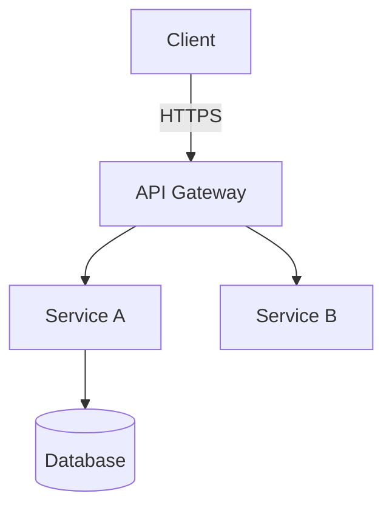

# Doc Co-authoring

Produce structured technical documents through a short interview, then write the
full document. Always ask clarifying questions first — never start writing without
understanding the purpose, audience, and scope.

## Step 1 — Identify Document Type

Ask the user which type of document they need:

1. **ADR** — Architecture Decision Record (a specific technical decision)
2. **Design Doc** — Technical design for a feature or system
3. **Runbook** — Step-by-step operational procedures
4. **Postmortem** — Incident retrospective
5. **Onboarding Guide** — Getting a new team member up to speed
6. **RFC** — Request for Comments on a proposal

If unclear from context, ask: *"What kind of document are we producing — a design doc, ADR, runbook, or something else?"*

## Step 2 — Interview (ask before writing)

Ask only the questions relevant to the document type. Keep it to 3–5 questions max.

### For ADR:
- What decision are we documenting?
- What alternatives were considered, and why were they rejected?
- What are the consequences (trade-offs) of this decision?
- Who are the decision makers / stakeholders?

### For Design Doc:
- What problem does this solve and who is affected?
- What is the proposed solution at a high level?
- What are the key technical components involved?
- What are the main risks or open questions?
- Who needs to review and approve this?

### For Runbook:
- What process or scenario does this runbook cover?
- Who runs this — on-call engineer, platform team, external party?
- What permissions/access do they need to have beforehand?
- What is the success/failure condition to know it worked?

### For Postmortem:
- What was the incident — what broke, for how long, how many users affected?
- What was the timeline of detection, response, and resolution?
- What were the contributing factors (not just root cause)?
- What action items are we committing to?

### For Onboarding Guide:
- What role is this for?
- What should someone be able to do independently after reading this?
- What tools, access, and accounts do they need?

---

## Templates

Write the document using the appropriate template below.

---

### ADR Template

```markdown
# ADR-{NNN}: {Decision Title}

**Date:** {YYYY-MM-DD}
**Status:** Proposed | Accepted | Deprecated | Superseded by ADR-{NNN}
**Deciders:** {Names or teams}
**Context source:** {Link to issue, Slack thread, meeting notes}

---

## Context

{1–3 paragraphs describing the problem or situation that necessitated this decision.
Include relevant constraints, the current state, and why action is needed now.}

## Decision

{State the decision clearly in one sentence: "We will use X for Y."}

{1–3 paragraphs explaining the rationale. Why this option over alternatives?}

## Alternatives Considered

| Option | Pros | Cons | Reason rejected |
|---|---|---|---|
| {Option A} | ... | ... | {why not chosen} |
| {Option B} | ... | ... | {why not chosen} |

## Consequences

**Positive:**
- {What gets better}

**Negative / Trade-offs:**
- {What gets worse or what debt is accepted}

**Risks:**
- {Known risks and mitigations}

## Implementation Notes

{Optional: key implementation guidance, migration steps, or things the team needs to do.}

## Review Notes

{Comments from reviewers — added during review process.}
```

---

### Design Doc Template

```markdown
# {Feature/System Name} — Technical Design

**Author(s):** {Names}
**Reviewers:** {Names}
**Date:** {YYYY-MM-DD}
**Status:** Draft | In Review | Approved | Implemented
**Related:** {Links to PRD, tickets, ADRs}

---

## Summary

{2–3 sentence executive summary. What are we building, why, and what is the
expected outcome? A reader should understand the full scope from this section alone.}

## Problem Statement

{What problem are we solving? Who is affected and how severely?
Include metrics if available: "X% of users experience Y, resulting in Z."}

## Goals and Non-Goals

**Goals:**
- {Concrete, measurable outcome}
- {Another goal}

**Non-Goals:**
- {What is explicitly out of scope and why}

## Proposed Solution

{High-level description of the solution. Prefer diagrams (Mermaid or ASCII) for
system interactions.}

### Architecture Diagram



### Component Breakdown

| Component | Responsibility | Technology |
|---|---|---|
| {Component A} | {What it does} | {Tech stack} |

### Key Design Decisions

{For each significant decision in this design:}
**Decision:** {What was decided}
**Rationale:** {Why}
**Trade-offs:** {What is given up}

### Data Model

{Schema, ERD, or key data structures}

### API Changes

{New or modified endpoints — link to OpenAPI spec changes}

### Security Considerations

- Authentication: {How is this authenticated}
- Authorisation: {Who can do what}
- Data sensitivity: {What sensitive data is handled and how}
- Threat model: {Key threats considered}

## Rollout Plan

| Phase | What | Success Criteria |
|---|---|---|
| 1 — Internal | Deploy to staging | No errors in logs, smoke tests pass |
| 2 — Canary | 5% of traffic | Error rate < 0.1%, p99 latency < X ms |
| 3 — Full rollout | 100% | {Metric} |

**Rollback plan:** {How to revert if something goes wrong}

## Monitoring and Alerting

| Signal | Metric | Alert threshold |
|---|---|---|
| Availability | Success rate | < 99.9% |
| Latency | p99 | > {X} ms |
| Error rate | 5xx / total | > 1% |

## Open Questions

| Question | Owner | Due |
|---|---|---|
| {Unresolved question} | {Name} | {Date} |

## Appendix

{Supporting data, references, spike results, benchmark numbers}
```

---

### Runbook Template

```markdown
# Runbook: {Process Name}

**Maintained by:** {Team}
**Last reviewed:** {YYYY-MM-DD}
**Applies to:** {Service/system name}
**Estimated time:** {X minutes}

---

## When to Use This Runbook

{Describe the exact scenario that triggers this runbook.
Include alert names, symptoms, or on-call escalation paths.}

## Prerequisites

Before starting:
- [ ] Access to {system/tool} — request via {link}
- [ ] Member of {IAM role/group}
- [ ] {Any other prerequisite}

## Steps

### 1. {Step name}

{Context for why this step is needed}

```bash
{Exact command to run}
```

**Expected output:** {What you should see if it worked}
**If this fails:** {What to do}

### 2. {Next step}

...

## Verification

{How to confirm the process completed successfully}

```bash
{Verification command}
```

Expected: {What success looks like}

## Rollback

{How to undo this procedure if something went wrong}

## Escalation

If this runbook does not resolve the issue:
1. {First escalation path — e.g., ping #platform-oncall}
2. {Second escalation — e.g., page {Name} via PagerDuty}
```

---

### Postmortem Template

```markdown
# Postmortem: {Incident Title}

**Date:** {YYYY-MM-DD}
**Severity:** SEV-{1|2|3}
**Duration:** {X hours Y minutes}
**Impact:** {Number of users affected, % of traffic, revenue impact if known}
**Author(s):** {Names}
**Status:** Draft | In Review | Final

---

## Summary

{2–3 sentences: what broke, for how long, and the business impact.}

## Timeline (UTC)

| Time | Event |
|---|---|
| {HH:MM} | {First symptom / alert fired} |
| {HH:MM} | {Who was paged, who responded} |
| {HH:MM} | {Diagnosis milestone} |
| {HH:MM} | {Mitigation applied} |
| {HH:MM} | {Service restored} |
| {HH:MM} | {Incident closed} |

## Root Cause

{Technical explanation of what failed and why. Avoid blame — focus on systems.}

## Contributing Factors

{List of factors that made this incident possible or worse — not just the proximate cause.}
- {Factor 1: e.g., No alerting on X meant detection was delayed}
- {Factor 2: e.g., Runbook for Y was out of date}

## What Went Well

- {Thing the team did well during the response}

## What Could Be Improved

- {Process or system gap identified}

## Action Items

| Action | Owner | Due date | Ticket |
|---|---|---|---|
| {Preventive action} | {Name} | {Date} | {Link} |
| {Detection improvement} | {Name} | {Date} | {Link} |
| {Runbook update} | {Name} | {Date} | {Link} |
```

---

## Writing Rules

1. **Write for the reader, not the writer.** Define acronyms on first use. Assume the reader is a competent engineer unfamiliar with this specific system.
2. **Be concrete.** Prefer specific metrics, commands, and examples over vague statements. "Reduces latency by 40%" is better than "improves performance".
3. **Keep sentences short.** One idea per sentence. Paragraphs of 3–5 sentences.
4. **Use tables for comparisons** and bullet points for lists of 3+ items.
5. **Date and version everything.** Every document must have a date and status.
6. **Diagrams beat prose for system interactions.** Use Mermaid if the platform renders it.

## What NOT to do

- Do not write the document before asking the interview questions
- Do not pad documents with filler — if a section is not applicable, omit it or write "N/A — not applicable for this decision"
- Do not write in passive voice where active is clearer
- Do not use jargon without defining it
- Do not skip the Open Questions section — unresolved questions left implicit become problems later
